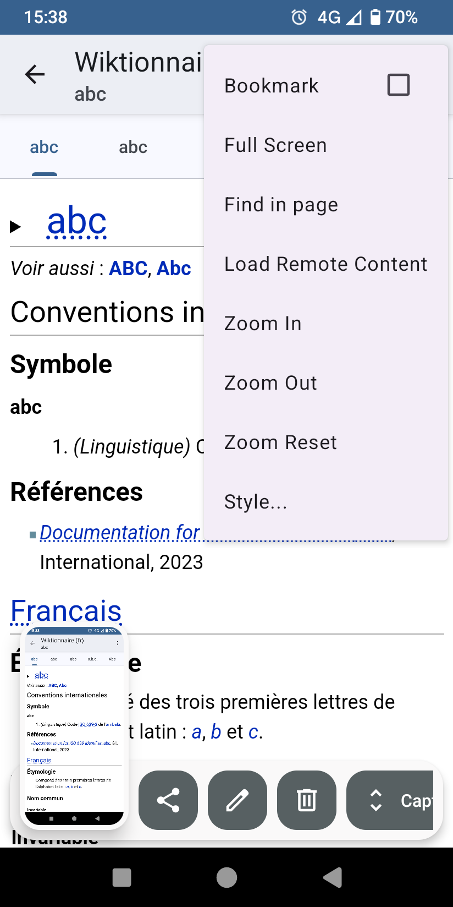
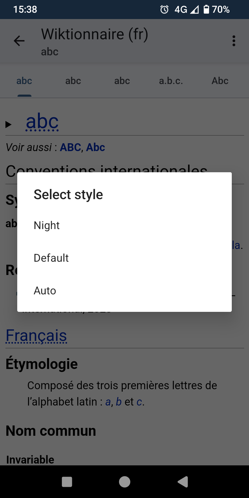
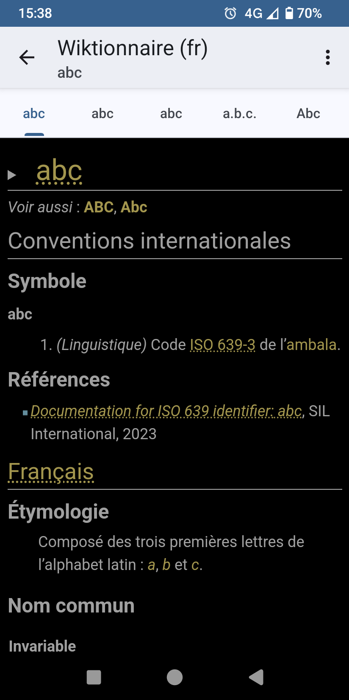

# Aardict for Android
  Aardict is a fork of [Aard 2 for Android](https://github.com/itkach/aard2-android). It
  comes with Material design 3 interface, bug fixes and improvements.

   
<h2 align="center">Enjoying Aardict?</h2>
<p align="center">Please consider making a small donation to help fund the project. Developing an application, especially one that is open source and completely free, takes a lot of time and effort.
<br>
<br>
<div align="center">
<a href="https://github.com/sponsors/farfromrefug">:heart: Sponsor</a>
</div>
<hr>

## Download

   - [Aardict](https://github.com/farfromrefug/aardict/releases)
   - [Dictionaries](https://github.com/itkach/slob/wiki/Dictionaries)


## Features

### Lookup

Lookup queries are punctuation, diacritics and case
insensitive.


### Bookmarks and History

Visited articles are automatically added to history and appear in
History tab. Articles can also be bookmarked (tap Bookmark icon
when viewing article). Bookmarked articles
appear in Bookmarks tab. Bookmarks and history can be
filtered and sorted by time or article title. Both bookmarks and
history are limited to a hundred of most recently used items. To
remove bookmark or history record, long tap a list item to enter
selection mode, tap items to be removed, tap Trash Can icon and
confirm. A bookmark can also be removed by tapping Bookmark icon
when viewing article.


### Dictionary Management

Dictionaries are added by selecting dictionary files using
Android's document chooser.

Note that application itself does not download dictionary files.

Opened dictionaries can be ordered by
marking and unmarking them as "favorite" (tap dictionary
title). Lookup results of equal match strength from multiple
dictionaries are presented in the order of dictionaries in the
dictionary list. Dictionaries can also be deactivated (turned
off). Turned off dictionaries do not participate in word lookup or
random article lookup,
but are still available when opening articles from bookmarks,
history or when following links in other articles. Unwanted dictionaries
can also be completely removed from the program (but dictionary files
are not deleted).


### Article Appearance

Dictionaries may include alternate style sheets. User may
also add custom style sheets via Settings tab. Dictionary built-in and
user styles appear in the "Style..." menu in article view.






### Math

Mathematical [formulas in Wikipedia](https://meta.wikimedia.org/wiki/Help:Displaying_a_formula) articles are rendered as text
using [MathJax](http://www.mathjax.org/) - scalable, styleable, beautiful on any screen.


### Random Article
Tapping application logo in main activity finds a random title
in an active dictionary and opens corresponding articles.
User may optionally limit random lookup to only use favorite
dictionaries.

### Volume Buttons Navigation
When viewing articles, volume up/down buttons scroll article
content or, if at the bottom (top) of the page, move to the next
(previous) article. Long press scrolls all the way to the bottom
(top). In main view volume buttons cycle through tabs. This
behavior can be disabled in settings.

### Fullscreen Mode
Articles can be viewed in fullscreen
mode. Pull down the top edge to exit fullscreen mode.

### Clipboard Auto-Paste
Text from clipboard can be automatically pasted into lookup field
(unless it contains a Web address, email or phone number). This
behavior is off by default and can be enabled in settings.

### External Link Sharing
Some dictionaries (such as Mediawiki based ones - Wikipedia,
Wiktionary etc.) contain external links. Long tap on the link to
share it without opening in a browser first.


## Requested Permissions
### android.permission.INTERNET
Aard 2 uses local embedded web server to provide article content. This
permission is necessary to run the server.

Also, articles may reference remote content such as images. This
permission is necessary to load it.

### android.permission.ACCESS_NETWORK_STATE
User chooses when to allow loading remote content: always,
when on Wi-Fi or never. This permission is necessary to
determine network connection state.

## Developing

  Aard 2 is built with [Gradle](http://www.gradle.org).

  Aard 2 depends on projects [slobber](https://github.com/itkach/slobj][slobj]] and [[https://github.com/itkach/slobber).

  Get the source code:

   ``` sh
   mkdir aard2
   cd aard2
   git clone https://github.com/itkach/slobj.git
   git clone https://github.com/itkach/slobber.git
   git clone https://github.com/farfromrefug/aardict.git
   ```

   Open [Android Studio](https://developer.android.com/sdk/installing/studio.html), go to `File`, `Open...`, select
   `aardict` directory and click `Open`.

   To build the APK on the command line:

   ``` sh
   cd aardict
   ./gradlew build
   ```

   To install the APK:

   ``` sh
   adb install -r build/outputs/apk/aardict-debug.apk
   ```

## Launching from Other Applications

   Aard 2 lookup can be initiated from other applications, either
   through standard `Share` action or directly, if application
   implemented an action to start Aard 2 with lookup intent.

   Applications can launch Aard 2 lookup by starting activity with intent
   ~aard2.lookup~ with text to look up passed as an extra string
parameter [SearchManager.QUERY](http://developer.android.com/reference/android/app/SearchManager.html#QUERY). For example:

   ``` java
   Intent intent = new Intent("aard2.lookup");
   intent.addFlags(Intent.FLAG_ACTIVITY_NEW_TASK | Intent.FLAG_ACTIVITY_CLEAR_TOP);
   intent.putExtra(SearchManager.QUERY, "Foo Bar");
   startActivity(intent);
   ```

   Same thing from a command line using `adb`:

   ``` sh
   adb shell am start -a aard2.lookup -f 335544320 -e query "Foo Bar"
   ```

## Translation

### Languages: [](https://hosted.weblate.org/engage/aardict/?utm_source=widget)

[](https://hosted.weblate.org/engage/aardict/)

The Translations are hosted by [Weblate.org](https://hosted.weblate.org/engage/aardict/).


<p align="center">
  <a href="https://raw.githubusercontent.com/farfromrefug/sponsorkit/main/sponsors.svg">
	
  </a>
</p>
